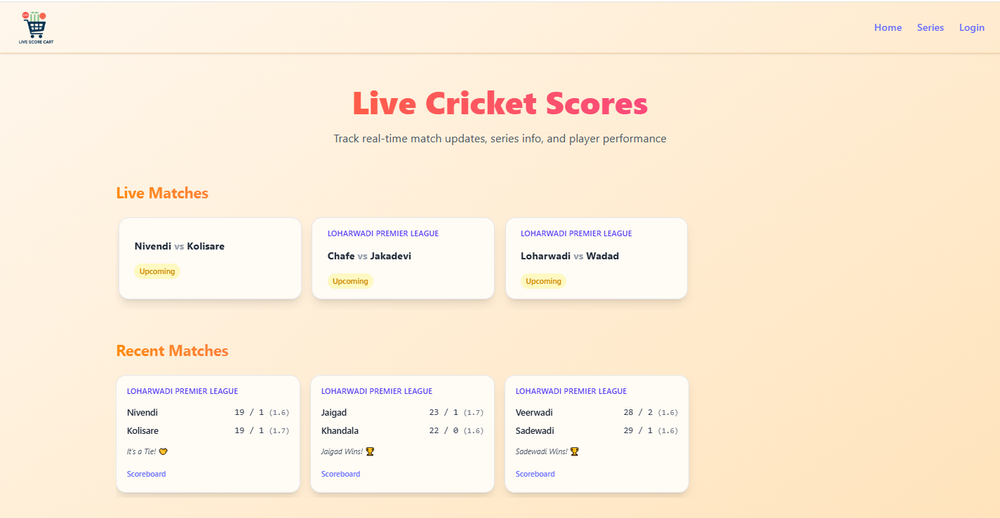
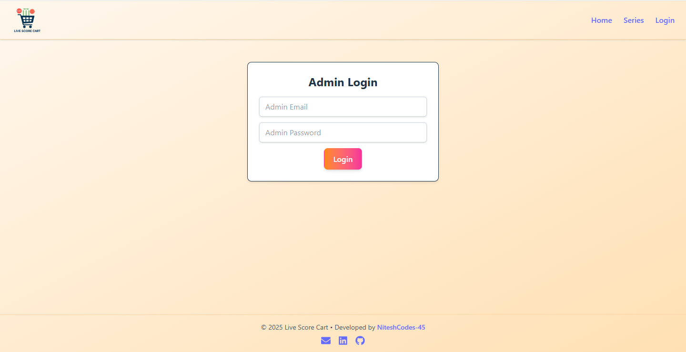
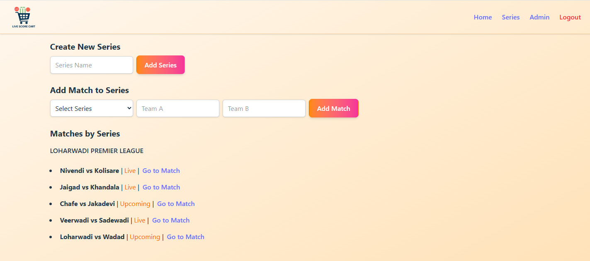

## Live Cricket Scoreboard
A real-time cricket scoreboard web app built with React, Firebase, and Vite. Designed for both public viewers and authenticated admins to update and track live cricket match scores seamlessly.

## Features
### Public Panel
- View live cricket scores, wickets, overs, and player details.
- Responsive UI for mobile, tablet, and desktop.

### Admin Panel
- Secure login via Firebase Authentication.
- Add/edit teams, players, scores, overs, and match status in real-time.
- Auto-sync updates using Firestore.

## Tech Stack
Frontend: React.js, Tailwind CSS, Vite
Backend: Firebase Firestore (Database), Firebase Authentication
Deployment: Vercel
Version Control: Git, GitHub

## Screenshots




## License
This project is licensed under the [MIT License](LICENSE).

## Live Demo
https://live-score-cart.vercel.app/

## Author
**Nitesh Chaughule**
[LinkedIn](https://www.linkedin.com/in/nitesh-chaughule-6637aa309) | [GitHub](https://github.com/NiteshCodes-45)

## Installation
```bash
git clone https://github.com/NiteshCodes-45/live-cricket-scoreboard.git
cd live-cricket-scoreboard

## Setup Instructions
1. Copy the `.env.example` file to `.env`
2. Fill in your Firebase credentials
3. Run `npm install` to install dependencies
4. Start the development server:
```bash
npm run dev