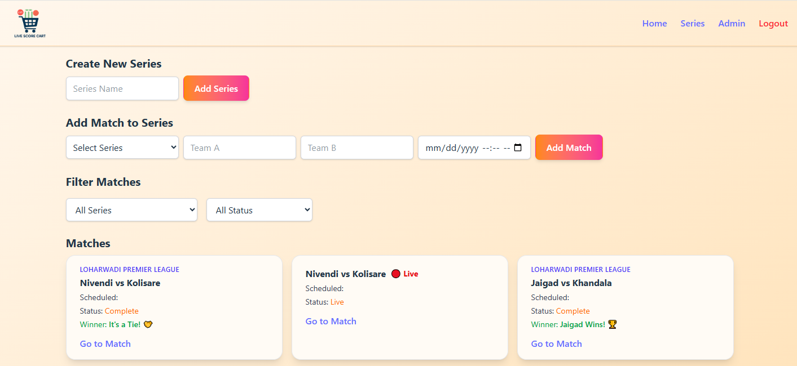

# Live Cricket Scoreboard

A real-time cricket match scoreboard for local tournaments, built using React, Firebase, and Tailwind CSS. Supports live match updates, series and match management, and secure admin access.

## Features
- Live score updates with Firebase Firestore
- Admin panel with authentication (Firebase Auth)
- Create and manage multiple series and matches
- Player-wise stats entry
- Responsive UI (mobile + desktop)

## Tech Stack
- React + Vite
- Tailwind CSS
- Firebase Firestore & Authentication
- React Router
- React Hooks

## Screenshots




## Installation
https://live-score-cart.vercel.app/

## Installation

```bash
git clone https://github.com/NiteshCodes-45/live-cricket-scoreboard.git
cd live-cricket-scoreboard
npm install
npm run dev